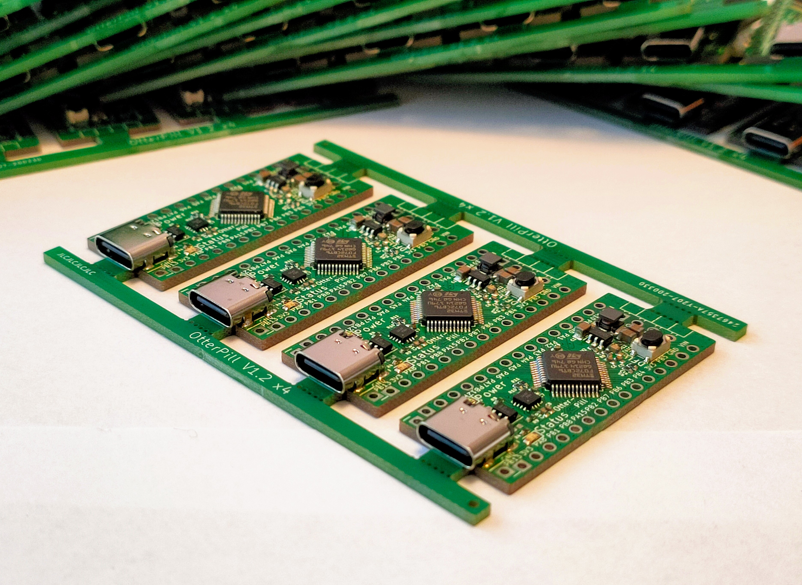
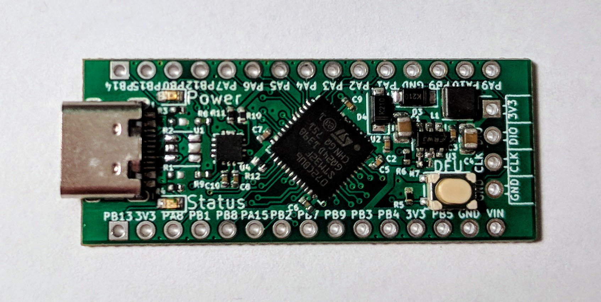
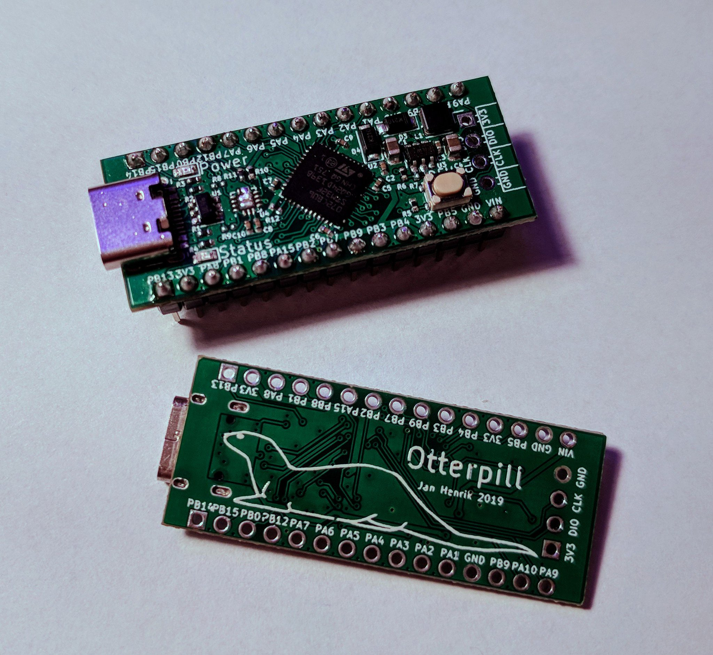

# OtterPill

**V1.2 is in a untested state**

STM32F072 devboard featuring USB 2.0 full-speed, DFU Bootloader, USB-PD Phy, Arduino nano alike pinout and size.

More documentation and firmware examples will be aviable soon. 

## Building and Flashing
### Via Arduino

[You can build and flash the firmware via Arduino as described here.](https://github.com/stm32duino/Arduino_Core_STM32)

## Via Makefile and DFU

Or you can generate a basic firmware with HAL init and Makefile with CubeMX. The binary can then be build with make flashed with dfu-utils.

    $ make
    $ dfu-util -a 0 -s 0x08000000:leave -D build/firmware.bin

## USB-PD example firmware

[https://github.com/Jan--Henrik/USB-PD-Firmware](https://github.com/Jan--Henrik/USB-PD-Firmware)

## Images

