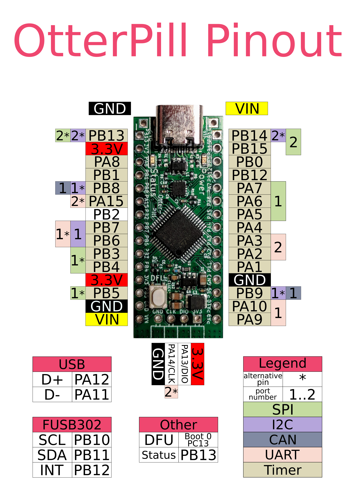
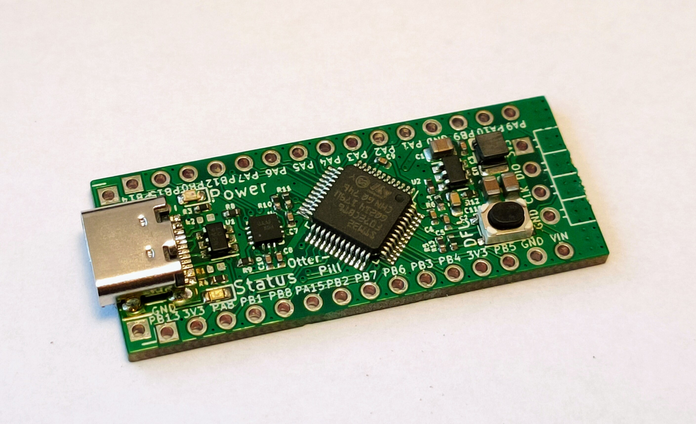
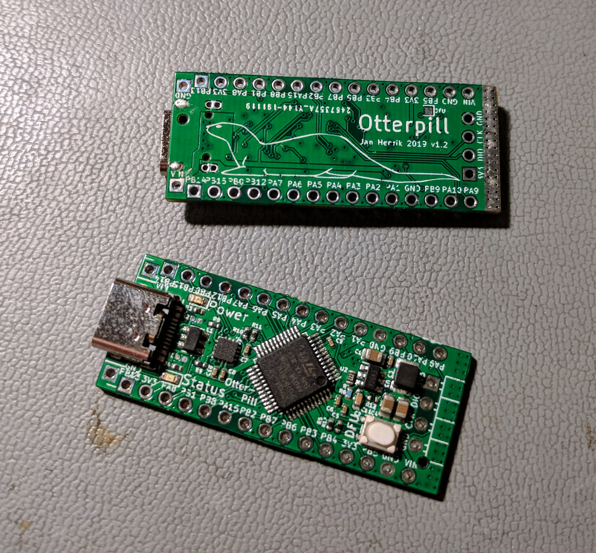

# OtterPill

OtterPill is a 3$ STM32F072 devboard featuring USB 2.0 full-speed, a DFU Bootloader, a USB-PD Phy and Arduino nano alike pinout and size.

Changelog V1.2: BOM cost reduction by ~40%, PCB can be fully populated by JLCSMT, more efficient buck converter (PCB gets less warm at 20V), GND-hook for probing, Reset-Pin exposed as pad, power pads for 20V/5A

More documentation and firmware examples will be aviable soon. 

**How do I get an OtterPill?** 
I have made a small production run, OtterPills will be available soon! More details will be announced via [Twitter](https://twitter.com/janhenrikh/) :3

## Building and Flashing
### Via Arduino

[You can build and flash the firmware via Arduino as described here.](https://github.com/stm32duino/Arduino_Core_STM32)

### Via Makefile and DFU

Or you can generate a basic firmware, with HAL init and Makefile, with CubeMX. The binary can then be build with make and flashed with dfu-utils. To enter DFU mode, press and hold the Button while plugging in power.

    $ make
    $ dfu-util -a 0 -s 0x08000000:leave -D build/firmware.bin

## Schematic

[HW v1.2/OtterPill.pdf](HW%20v1.2/OtterPill.pdf)

## Pinout

Pinout by [SarahhhhFoster](https://github.com/SarahhhhFoster) :)

## Blink example firmware

[Blink/](Blink/)

## Rust example

Thank you [@jamesmunns](https://github.com/jamesmunns)! :3

[https://github.com/jamesmunns/OtterPill-rs](https://github.com/jamesmunns/OtterPill-rs)

## STM workshop based on OtterPill

[https://github.com/Jan--Henrik/hackerhotel-stm-workshop](https://github.com/Jan--Henrik/hackerhotel-stm-workshop)

## USB-PD example firmware

This is a working USB-PD example using ChibiOS, a new voltage can be requested by pressing the Button.

[https://github.com/Jan--Henrik/USB-PD-Firmware](https://github.com/Jan--Henrik/USB-PD-Firmware)

## Shields and addons

Most Arduino shields should be compatible.

#### [USB-to-CAN-adapter](https://github.com/Jan--Henrik/OtterPill-CAN-Adapter)

## Images

### Rev 1.1

### Rev 1.2

